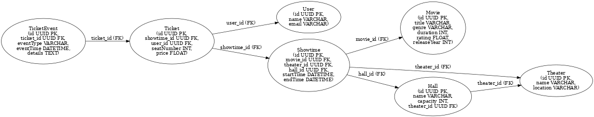

# 🎬 Movie Ticket Booking System

## 📌 Project Description

The **Movie Ticket Booking System** is a **Spring Boot** application that allows users to:

- Browse **movies**, **theaters**, **halls**, and **showtimes**.
- **Book** and **cancel** tickets.
- View **ticket history** and track booking events.

This system uses **Spring Boot**, **Spring Data JPA**, **H2/PostgreSQL**, and **Swagger UI**.

---

## ⚡ Features

- 🎟 **Ticket Booking & Management** (Booking, Cancellation, Seat Change)
- 🎬 **Movie & Showtime Management**
- 🏛 **Theater & Hall Management**
- 🔍 **Swagger API Documentation**
- 💾 **H2 Database (In-memory) for local testing**
- 🚀 **PostgreSQL support for production**

---

## 🛠️ Technologies Used

- **Java 23**
- **Spring Boot 3.4.3**
- **Spring Data JPA**
- **H2 Database / PostgreSQL**
- **Lombok**
- **Swagger (OpenAPI 3.0)**

---

## 🗄️ Database Schema & Relationships

Below is the database schema and relationships:



---

## 🚀 Getting Started

### 📌 Prerequisites

Ensure you have installed:

- **Java 23**
- **Maven**
- **Docker** (Optional, for running PostgreSQL)

### 🔧 Installation Steps

1️⃣ **Clone the Repository**

```sh
git clone https://github.com/YOUR_GITHUB_USERNAME/MovieTicketBooking.git
cd MovieTicketBooking
```

2️⃣ **Configure Database**

- Default database: **H2 (in-memory)** (No setup needed for local testing)
  
  http://localhost:8080/h2-console

- For **PostgreSQL**, update `application.properties`:
  ```properties
  spring.datasource.url=jdbc:postgresql://localhost:5432/movieticketbooking
  spring.datasource.username=your_username
  spring.datasource.password=your_password
  spring.jpa.hibernate.ddl-auto=update
  ```
- Run PostgreSQL using Docker:
  ```sh
  docker run --name postgres-db -e POSTGRES_USER=your_username -e POSTGRES_PASSWORD=your_password -e POSTGRES_DB=movieticketbooking -p 5432:5432 -d postgres
  ```

3️⃣ **Build and Run the Application**

```sh
mvn clean install
mvn spring-boot:run
```

---

## 🌐 API Documentation (Swagger UI)

Once the server is running, open the **Swagger UI**:

- [http://localhost:8080/swagger-ui.html](http://localhost:8080/swagger-ui.html)

---

## [🔧 API Endpoints](http://localhost:8080/swagger-ui.html)

### 🎬 Movies

| Method | Endpoint           | Description     |
| ------ | ------------------ | --------------- |
| GET    | `/api/movies`      | Get all movies  |
| GET    | `/api/movies/{id}` | Get movie by ID |
| POST   | `/api/movies`      | Add a new movie |
| PUT    | `/api/movies/{id}` | Update movie    |
| DELETE | `/api/movies/{id}` | Delete movie    |

### 🎟 Tickets

| Method | Endpoint            | Description            |
| ------ | ------------------- | ---------------------- |
| GET    | `/api/tickets`      | Get all booked tickets |
| GET    | `/api/tickets/{id}` | Get ticket details     |
| POST   | `/api/tickets/book` | Book a ticket          |
| DELETE | `/api/tickets/{id}` | Cancel a ticket        |

📌 **For more API endpoints, visit Swagger UI!**

---

## 🐳 Docker Setup

To run the application with **Docker**, use:

```sh
docker build -t movie-ticket-booking .
docker run -p 8080:8080 movie-ticket-booking
```

---

## 🛡️ Security (Upcoming Features)

- **User Authentication & Roles (Admin/User)**
- **JWT-Based Security**

---

## 📜 License

This project is licensed under the **MIT License**.

---

## 🤝 Contributing

Want to contribute? Feel free to fork the repo and submit a pull request!

---

## 📩 Contact

For queries or suggestions, contact [**your_email@example.com**](mailto:your_email@example.com).

---

🚀 **Happy Coding!** 🎥🎟
